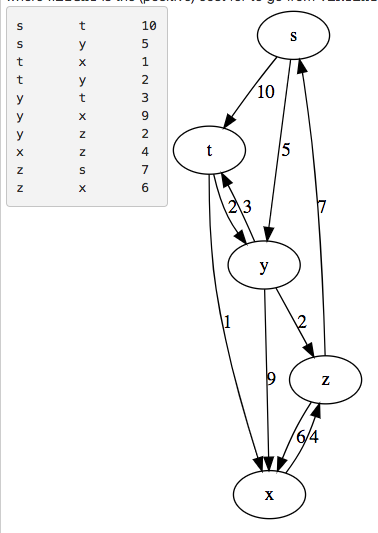

# ShortestPaths
This program performs path weight calculations from a starting vertex 
of a directed graph and prints the results to the screen. The graph is populated by calling appropriate methods to read and parse info from a file, which can be entered at the command line.

* Example input file format and respective directed graph

* Running the program and the results

